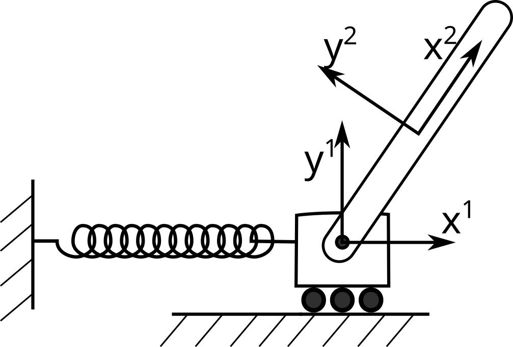

# **ME 5180: Advanced Dynamics | Project 03 | Group 07**

## Group Members:
[Christian DiPietrantonio](mailto:hwp25002@uconn.edu)

## Project Overview
<p align="center">
    
</p>

In this project, a rigid bar is connected to a sliding block along a
horizontal tracks. The sliding block is connected to a spring that stretches and compresses. The rigid bar $L = 0.4~m$ acts as a compound pendulum.  

1. $x_1-y_1-$ describes block 1 position and orientation, $\theta_1$
2. $x_2-y_2-$ describes the rigid bar position and orientation, $\theta_2$

The applied forces are, 

1. Spring attached to block 1, $F = -k x_1$ where $k = 10~N/m$
2. gravity acting on block 1 and the rigid bar, $F_1 = -m_1g\hat{j}$ and $F_2 = -m_2 g\hat{j}$ where $m_1 = 0.1$ kg and $m_2 = 0.3$ kg
 
In this project, you need to 

1. determine constraint equations $C(\mathbf{q},~t)$
2. Create an augmented solution method for the dynamic motion of these two moving parts
3. visualize the motion of the system as the two parts complete at least one oscillation
4. calculate and show (graph or vectors) the constraint forces acting on the 2-body system

## Results

TBD

## Conclusions

TBD

## Derivations

**Note:** the following derivations use GitHub-compatible Markdown/LaTeX formatting. Certain expressions (e.g., subscripts or matrix notation) may need modification for standard LaTeX/Markdown environments.

In planar (2D) multibody dynamics, each unconstrained body has 3 degrees of freedom:
- Translation in the $x$-direction
- Translation in the $Y$-direction
- Rotation by angle $\theta$. 

Therefore, the generalized coordinate vector for this project can be expressed as:

$$
\vec{q} =
\begin{bmatrix}
    x_1 \\
    y_1 \\
    \theta_1 \\
    x_2 \\
    y_2 \\
    \theta_2 \\
\end{bmatrix}
$$

If a the center of body i is located at $\vec{R}_i = [x_i, y_i]^T$ in the global coordinate system and orientation $\theta_i$, then point p located at $\vec{s}^{(i)} = [s_x, s_y]^T$ in the body's local frame has global position:

$$
\vec{r}_P = \vec{R}_i + A(\theta_i) \, \vec{s}^{(i)}
$$

Where $A(\theta_i)$ is the rotation matrix:

$$
A(\theta_i) =
\begin{bmatrix}
\cos\theta_i & -\sin\theta_i \\
\sin\theta_i & \cos\theta_i
\end{bmatrix}
$$

For this project, there are 6 coordinates and 2 degrees of freedom (the block is free to translate, and the bar is free to rotate). Therefore, $6 - 2 = 4$ constraint equations are required.

### Block Center (Body 1)

The pin joint connects at the center of the block. In the block's local frame, the center is at the origin: $\vec{s}_{pin,1} = [0, 0]^T$. Therefore, the pin location on the block in global coordinates is:

$$
\vec{r}_{pin,1} = 
\vec{R}_1 + A(\theta_1) 
\begin{bmatrix} 
0 \\ 
0 
\end{bmatrix} 
\= 
\begin{bmatrix} 
x_1 \\
y_1 
\end{bmatrix}
$$

### Bar Pin End (Body 2)

The bar's local $x$-axis runs along its length. The bar has length $L$, and its center of mass is at the midpoint, therefore the end that connects to the block is at local coordinates $\vec{s}_{pin,2} = [-L/2, \, 0]^T$ 

To express this point in global coordinates:

$$
\vec{r}_{pin,2} = 
\vec{R}_2 + A(\theta_2) 
\begin{bmatrix} 
-L/2 \\ 
0 
\end{bmatrix}
$$

Expanding the matrix-vector product:

$$
A(\theta_2) 
\begin{bmatrix} 
-L/2 \\ 
0 
\end{bmatrix}
\= 
\begin{bmatrix} 
\cos\theta_2 & -\sin\theta_2 \\ 
\sin\theta_2 & \cos\theta_2 
\end{bmatrix} 
\begin{bmatrix} 
-L/2 \\ 
0 
\end{bmatrix}
$$

$$
= 
\begin{bmatrix} 
(-L/2)\cos\theta_2 + (0)(-\sin\theta_2) \\ 
(-L/2)\sin\theta_2 + (0)(\cos\theta_2) 
\end{bmatrix}
\= 
\begin{bmatrix} 
-\frac{L}{2}\cos\theta_2 \\ 
-\frac{L}{2}\sin\theta_2 
\end{bmatrix}
$$

Therefore:

$$
\vec{r}_{pin,2} = 
\begin{bmatrix} 
x_2 - \frac{L}{2}\cos\theta_2 \\ 
y_2 - \frac{L}{2}\sin\theta_2 
\end{bmatrix}
$$

### Bar Free End (Body 2)

The other end of the bar (the free, swinging end) is at local coordinates $\vec{s}_{free} = [+L/2, \, 0]^T$. Therefore, this point can be expressed in global coordinates as:

$$
\vec{r}_{free} = 
\begin{bmatrix}
 x_2 + \frac{L}{2}\cos\theta_2 \\ 
 y_2 + \frac{L}{2}\sin\theta_2 
\end{bmatrix}
$$

The constraint equations can now be assembled.

### Constraint $C_1$: Sliding Joint (Position)

The block slides along a horizontal track at $y = 0$. The center of the block must remain at $y_1 = 0$:

$$
\boxed{C_1 = y_1 = 0}
$$

This eliminates vertical motion of the block and the track must exert a normal force to maintain this constraint.

### Constraint $C_2$: Sliding Joint (Orientation)

Due to the sliding joint, the orientation of the block is constrained to:
$$
\boxed{C_2 = \theta_1 = 0}
$$

In this case, the constraint force is a moment (torque) that keeps $\theta_1 = 0$.

### Constraint $C_3$: Pin Joint ($x$-Component)

The revolute (pin/hinge) joint forces the pin end of the bar to coincide with the center of the block. As a result, these two points must have the same global position:

$$
\vec{r}_{pin,1} = \vec{r}_{pin,2}
$$

Which yields the following constraint equation for the x-component:

$$
x_1 = x_2 - \frac{L}{2}\cos\theta_2
$$

Rearranging so the constraint equals zero:

$$
\boxed{C_3 = x_1 - x_2 + \frac{L}{2}\cos\theta_2 = 0}
$$

### Constraint $C_4$: Pin Joint ($y$-Component)
Again, since the revolute (pin/hinge) joint forces the pin end of the bar to coincide with the center of the block, it yields the following constraint equation for the y-component:

$$
y_1 = y_2 - \frac{L}{2}\sin\theta_2
$$

$$
\boxed{C_4 = y_1 - y_2 + \frac{L}{2}\sin\theta_2 = 0}
$$

### Constraint Equations

Therefore, the full constraint vector can be written as:

$$
\vec{C}(\vec{q}, t) =
\begin{bmatrix}
C_1 \\
C_2 \\
C_3 \\
C_4
\end{bmatrix}
\=
\begin{bmatrix}
y_1 \\
\theta_1 \\
x_1 - x_2 + \frac{L}{2}\cos\theta_2 \\
y_1 - y_2 + \frac{L}{2}\sin\theta_2
\end{bmatrix}
= \vec{0}
$$

Given that none of these constraints depend explicitly on time $t$, the partial time derivative vector, $\vec{C}_t = \frac{\partial \vec{C}}{\partial t} = \vec{0}$.

The constraint Jacobian, $C_q = \frac{\partial \vec{C}}{\partial \vec{q}}$ can now be evaluated as:

$$
C_q =
\begin{bmatrix}
0 & 1 & 0 & 0 & 0 & 0 \\
0 & 0 & 1 & 0 & 0 & 0 \\
1 & 0 & 0 & -1 & 0 & -\frac{L}{2}\sin\theta_2 \\
0 & 1 & 0 & 0 & -1 & \frac{L}{2}\cos\theta_2
\end{bmatrix}
$$

Thus, the velocity constraint equation $C_q \, \dot{\vec{q}} = - \vec{C}_t$ can be constructed. Since $\vec{C}_t = \vec{0}$, the velocity constraint equation simplifies to:

$$
C_q \, \dot{\vec{q}} = \vec{0}
$$

and can be expressed in full as:

$$
\begin{bmatrix}
0 & 1 & 0 & 0 & 0 & 0 \\
0 & 0 & 1 & 0 & 0 & 0 \\
1 & 0 & 0 & -1 & 0 & -\frac{L}{2}\sin\theta_2 \\
0 & 1 & 0 & 0 & -1 & \frac{L}{2}\cos\theta_2
\end{bmatrix}
\begin{bmatrix}
\dot{x}_1 \\
\dot{y}_1 \\
\dot{\theta}_1 \\
\dot{x}_2 \\
\dot{y}_2 \\
\dot{\theta}_2 \\
\end{bmatrix}
\=
\begin{bmatrix}
0 \\
0 \\
0 \\
0 \\
\end{bmatrix}
$$

The acceleration constraint equation can be found by taking the time derivative of the velocity equation:

$$
\frac{d}{dt} \left(C_q \, \dot{\vec{q}}\right) + \frac{d}{dt}\left(\vec{C}_t\right) = \vec{0}
$$

The equation above can be rewritten as:

$$
C_q \, \ddot{\vec{q}} = \vec{Q}_d
$$

where:

$$
\vec{Q}_d = -\frac{d C_q}{dt} \, \dot{\vec{q}} - \frac{d \vec{C}_t}{dt}
$$

Since $\theta_2$ changes with time, $\frac{d}{dt} f\left(\theta_2\right) = \frac{d f}{d \theta_2} \dot{\theta}_2$. So:

$$
\frac{d C_q}{d t} = 
\begin{bmatrix}
0 & 0 & 0 & 0 & 0 & 0 \\
0 & 0 & 0 & 0 & 0 & 0 \\
0 & 0 & 0 & 0 & 0 & \left(-\frac{L}{2}\cos\theta_2\right)\dot{\theta}_2 \\
0 & 0 & 0 & 0 & 0 & \left(-\frac{L}{2}\sin\theta_2\right)\dot{\theta}_2
\end{bmatrix}
$$

Therefore, 

$$
\frac{d C_q}{dt} \, \dot{\vec{q}} = 
\begin{bmatrix}
0 \\
0 \\
\left(-\frac{L}{2}\cos\theta_2\right)\dot{\theta}_2^2 \\
\left(-\frac{L}{2}\sin\theta_2\right)\dot{\theta}_2^2 
\end{bmatrix}
$$

Since $\vec{C}_t = \vec{0}$, $\frac{d C_t}{d t} = \vec{0}$, thus:

$$
\vec{Q}_d =
\begin{bmatrix}
0 \\
0 \\
\left(\frac{L}{2}\cos\theta_2\right)\dot{\theta}_2^2 \\
\left(\frac{L}{2}\sin\theta_2\right)\dot{\theta}_2^2 
\end{bmatrix}
$$

and the final acceleration constraint equation can be constructed: 

$$
\begin{bmatrix}
0 & 1 & 0 & 0 & 0 & 0 \\
0 & 0 & 1 & 0 & 0 & 0 \\
1 & 0 & 0 & -1 & 0 & -\frac{L}{2}\sin\theta_2 \\
0 & 1 & 0 & 0 & -1 & \frac{L}{2}\cos\theta_2
\end{bmatrix}
\begin{bmatrix}
\ddot{x}_1 \\
\ddot{y}_1 \\
\ddot{\theta}_1 \\
\ddot{x}_2 \\
\ddot{y}_2 \\
\ddot{\theta}_2 
\end{bmatrix}
\=
\begin{bmatrix}
0 \\
0 \\
\left(\frac{L}{2}\cos\theta_2\right)\dot{\theta}_2^2 \\
\left(\frac{L}{2}\sin\theta_2\right)\dot{\theta}_2^2 
\end{bmatrix}
$$

### Mass Matrix

In the augmented MBD approach, each body contributes a $3 \times 3$ block to the diagonal mass matrix:

$$
M_i = 
\begin{bmatrix} 
m_i & 0 & 0 \\
0 & m_i & 0 \\ 
0 & 0 & I_i 
\end{bmatrix}
$$

where $m_i$ is the body's mass and $I_i$ is its moment of inertia about its center of mass.

**Block (Body 1) Moment of Inertia:** For a thin rectangular plate rotating about its center, the mass moment of inertia can be expressed as:

$$
I_1 = \frac{m_1 (w^2 + h^2)}{12}
$$

where $w = 0.10$ m and $h = 0.05$ m are the block dimensions used for visualization.

**Bar (Body 2) Moment of Inertia:** For a thin rod rotating about its center, the mass moment of inertia can expressed as:

$$
I_2 = \frac{1}{12} m_2 L^2 = \frac{1}{12}(0.3)(0.4)^2 = 0.004 \text{ kg⋅m}^2
$$

Therefore, the full mass matrix can be written as:

$$
M =
\begin{bmatrix}
m_1 & 0 & 0 & 0 & 0 & 0 \\
0 & m_1 & 0 & 0 & 0 & 0 \\
0 & 0 & I_1 & 0 & 0 & 0 \\
0 & 0 & 0 & m_2 & 0 & 0 \\
0 & 0 & 0 & 0 & m_2 & 0 \\
0 & 0 & 0 & 0 & 0 & I_2
\end{bmatrix}
\=
\begin{bmatrix}
0.1 & 0 & 0 & 0 & 0 & 0 \\
0 & 0.1 & 0 & 0 & 0 & 0 \\
0 & 0 & I_1 & 0 & 0 & 0 \\
0 & 0 & 0 & 0.3 & 0 & 0 \\
0 & 0 & 0 & 0 & 0.3 & 0 \\
0 & 0 & 0 & 0 & 0 & 0.004
\end{bmatrix}
$$


### The External Force Vector $\vec{Q}_e$
The generalized external force vector can now be created using the applied forces listed above:

$$
\vec{Q}_e =
\begin{bmatrix}
-k \, x_1 \\
-m_1 g \\
0 \\
0 \\
-m_2 g \\
0
\end{bmatrix}
\=
\begin{bmatrix}
-10 \, x_1 \\
-0.981 \\
0 \\
0 \\
-2.943 \\
0
\end{bmatrix}
$$ 

### The Augmented MBD System

The augmented technique stacks Newton's second law with the acceleration level constraints into one system:

$$
\begin{bmatrix}
M & C_{\vec{q}}^T \\
C_{\vec{q}} & 0
\end{bmatrix}
\begin{bmatrix}
\ddot{\vec{q}} \\
\vec{\lambda}
\end{bmatrix}
\=
\begin{bmatrix}
\vec{Q}_e \\
\vec{Q}_d
\end{bmatrix}
$$

which can be fully written as:

$$
\begin{bmatrix}
m_1 & 0 & 0 & 0 & 0 & 0 & 0 & 0 & 1 & 0  \\
0 & m_1 & 0 & 0 & 0 & 0 & 1 & 0 & 0 & 1  \\
0 & 0 & I_1 & 0 & 0 & 0 & 0 & 1 & 0 & 0  \\
0 & 0 & 0 & m_2 & 0 & 0 & 0 & 0 & -1 & 0 \\
0 & 0 & 0 & 0 & m_2 & 0 & 0 & 0 & 0 & -1 \\
0 & 0 & 0 & 0 & 0 & I_2 & 0 & 0 & -\frac{L}{2}\sin\theta_2 & \frac{L}{2}\cos\theta_2 \\
0 & 1 & 0 & 0 & 0 & 0 & 0 & 0 & 0 & 0 \\
0 & 0 & 1 & 0 & 0 & 0 & 0 & 0 & 0 & 0 \\
1 & 0 & 0 & -1 & 0 & -\frac{L}{2}\sin\theta_2 & 0 & 0 & 0 & 0 \\
0 & 1 & 0 & 0 & -1 & \frac{L}{2}\cos\theta_2 & 0 & 0 & 0 & 0
\end{bmatrix}
\begin{bmatrix}
\ddot{x}_1 \\
\ddot{y}_1 \\
\ddot{\theta}_1 \\
\ddot{x}_2 \\
\ddot{y}_2 \\
\ddot{\theta}_2 \\
\lambda_{1} \\
\lambda_{2} \\
\lambda_{3} \\
\lambda_{4}
\end{bmatrix}
\=
\begin{bmatrix}
-k \, x_1 \\
-m_1 g \\
0 \\
0 \\
-m_2 g \\
0 \\
0 \\
0 \\
\left(\frac{L}{2}\cos\theta_2\right)\dot{\theta}_2^2 \\
\left(\frac{L}{2}\sin\theta_2\right)\dot{\theta}_2^2
\end{bmatrix}
$$

or further as:

$$
\begin{bmatrix}
0.1 & 0 & 0 & 0 & 0 & 0 & 0 & 0 & 1 & 0  \\
0 & 0.1 & 0 & 0 & 0 & 0 & 1 & 0 & 0 & 1  \\
0 & 0 & I_1 & 0 & 0 & 0 & 0 & 1 & 0 & 0  \\
0 & 0 & 0 & 0.3 & 0 & 0 & 0 & 0 & -1 & 0 \\
0 & 0 & 0 & 0 & 0.3 & 0 & 0 & 0 & 0 & -1 \\
0 & 0 & 0 & 0 & 0 & 0.004 & 0 & 0 & -\frac{L}{2}\sin\theta_2 & \frac{L}{2}\cos\theta_2\\
0 & 1 & 0 & 0 & 0 & 0 & 0 & 0 & 0 & 0 \\
0 & 0 & 1 & 0 & 0 & 0 & 0 & 0 & 0 & 0 \\
1 & 0 & 0 & -1 & 0 & -\frac{L}{2}\sin\theta_2 & 0 & 0 & 0 & 0 \\
0 & 1 & 0 & 0 & -1 & \frac{L}{2}\cos\theta_2 & 0 & 0 & 0 & 0
\end{bmatrix}
\begin{bmatrix}
\ddot{x}_1 \\
\ddot{y}_1 \\
\ddot{\theta}_1 \\
\ddot{x}_2 \\
\ddot{y}_2 \\
\ddot{\theta}_2 \\
\lambda_{1} \\
\lambda_{2} \\
\lambda_{3} \\
\lambda_{4}
\end{bmatrix}
\=
\begin{bmatrix}
-10 \, x_1 \\
-0.981 \\
0 \\
0 \\
-2.943 \\
0 \\
0 \\
0 \\
\left(\frac{L}{2}\cos\theta_2\right)\dot{\theta}_2^2 \\
\left(\frac{L}{2}\sin\theta_2\right)\dot{\theta}_2^2
\end{bmatrix}
$$

In this case, given that $M$ is a $6 \times 6$ mass matrix, $C_{\vec{q}}$ is a $4 \times 6$ Jacobian, $\vec{Q}\_e$ contains the external forces, and $\vec{Q}\_d$ collects the known terms from differentiating the constraints twice. The unknowns are the accelerations $\ddot{\vec{q}}$, and the Lagrange multipliers ($\lambda_{1}$, $\lambda_{2}$, $\lambda_{3}$, $\lambda_{4}$). Therefore, at each time step, a $10 \times 10$ linear system must be solved.

### Baumgarte Stabilization
Instabilities resulting from integration at the acceleration level are corrected using the  the Baumgarte stabilization technique. In order to do so, the acceleration level constraints are re-expressed as:

$$
C_q \, \ddot{\vec{q}} = \vec{Q}_d - 2\alpha \left( C_q \dot{\vec{q}} + \vec{C}_t \right) - \beta^2 \vec{C}
$$

and again, given that $\vec{C}_t = \vec{0}$, the equation above can be rewritten as:

$$
\boxed{C_q \, \ddot{\vec{q}} = \vec{Q}_d - 2\alpha \, C_q \dot{\vec{q}} - \beta^2 \vec{C}}
$$

where $\alpha = 5$ and $\beta = 5$ are stabilization parameters that control how aggressively the instabilities are corrected.

### Initial Conditions
Before starting the simulation, the following parameters are required:
- $\vec{q}_0$: initial positions that satisfy all constraints
- $\dot{\vec{q}}_0$: initial velocities that satisfy all constraints (the simplest selection is releasng the objects from rest, so $\dot{\vec{q}}_0 = \vec{0}$)

Given that there are 4 constraint equations and 6 unknowns, the following must be specified to determine the initial configuration of the system:

- $x_1(0) = 0$ m (block at the spring's natural length)
- $\theta_2(0) = 0$ rad (bar initially horizontal)

The system now has an equal ammount of equations as unknowns, and can be solved for the initial time step. From the constraint equations at $t = 0$ with $x_1 = 0$, $\theta_2 = 0$:

- $C_1$: $y_1 = 0$
- $C_2$: $\theta_1 = 0$
- $C_3$: $0 - x_2 + \frac{L}{2}\cos(0) = 0 \rightarrow x_2 = L/2 = 0.2$ m
- $C_4$: $0 - y_2 + \frac{L}{2}\sin(0) = 0 \rightarrow y_2 = 0$

Therefore:

$$
\vec{q}_0 = 
\begin{bmatrix} 0 \\ 
0 \\ 
0 \\ 
0.2 \\ 
0 \\ 
0 
\end{bmatrix}, \qquad
\dot{\vec{q}}_0 = 
\begin{bmatrix} 
0 \\ 
0 \\ 
0 \\ 
0 \\ 
0 \\ 
0 
\end{bmatrix}
$$

Thus the system is released from rest with the bar in the horizontal position and gravity will pull the bar downward, initiating the motion of the system.

### Extracting Constraint Forces
The Lagrange multipliers $\vec{\lambda} = [\lambda_1,\, \lambda_2,\, \lambda_3,\, \lambda_4]^T$ represent the magnitudes of the constraint forces associated with each constraint equation. Where each $\lambda_i$ is associated with one constraint:

- $\lambda_1 \rightarrow C_1 = y_1 = 0 \rightarrow$ Normal force from track on block (y-direction)
- $\lambda_2 \rightarrow C_2 = \theta_1 = 0 \rightarrow$ Moment from track preventing block rotation
- $\lambda_3 \rightarrow C_3 \rightarrow$ Pin joint force, x-component
- $\lambda_4 \rightarrow C_4 \rightarrow$ Pin joint force, y-component

The constraint forces on each generalized coordinate are expressed as

$$
\vec{Q}_c = C_q^T \, \vec{\lambda}
$$

where:

$$
C_q^T \vec{\lambda} =
\begin{bmatrix}
0 & 0 & 1 & 0 \\
1 & 0 & 0 & 1 \\
0 & 1 & 0 & 0 \\
0 & 0 & -1 & 0 \\
0 & 0 & 0 & -1 \\
0 & 0 & -\frac{L}{2}\sin\theta_2 & \frac{L}{2}\cos\theta_2
\end{bmatrix}
\begin{bmatrix}
\lambda_1 \\ 
\lambda_2 \\ 
\lambda_3 \\ 
\lambda_4
\end{bmatrix}
$$

### Solution Process
The overall solution process for the system above will consist the following steps.

1. Solve for initial $\vec{q}_0$ such that $\vec{C}\left(\vec{q}_0, t=0\right) = \vec{0}$
2. Set $\dot{\vec{q}}_0 = 0$ (released from rest)
3. Assemble initial state $y_0 = \left[\vec{q}_0, \dot{\vec{q}}_0\right]$
4. Integrate from $t = 0$ to $t = t_{\text{end}}$
5. Post-process
6. Generate plots and animation

Where at each time step, $i$, the integrator uses $\vec{q}_i$ and $\dot{\vec{q}}_i$ from the current state to:
1. Build the mass matrix, $M$
2. Build the Jacobian, $C_q(\vec{q}_i)$
3. Build the external force vector, $\vec{Q}_e(\vec{q}_i)$
4. Build the acceleration constraints, $\vec{Q}_d(\vec{q}_i, \dot{\vec{q}}_i)$
5. Assemble the augmented system
6. Apply Baumgarte stabilization
7. Solve the linear system for $\ddot{\vec{q}}_i$ and $\vec{\lambda}_i$
8. Return $\dot{y}_i = [\dot{\vec{q}}_i, \ddot{\vec{q}}_i]$ back to the integrator

## Reproducing Results
From the project directory, run:

```bash
julia main.jl 
```

The program may take a few minutes to run. All final plots are output to the `results/` directory.

## Project Dependencies
This project was developed and tested with **Julia version 1.12.4**

The following packages are required:
- `NonlinearSolve`
- `DifferentialEquations`
- `LinearAlgebra`
- `Plots`
- `Measures`
- `LaTeXStrings`

## Project Structure
```
project_03-7/
|
├───── archive/ # old plots and files
|
├───── results/ # program outputs (plots)
|
├───── src/     # source Code
|       |
|       ├───── constraints.jl      # constraint equations, Jacobian, mass matrix, forces
|       |
|       ├───── dynamics.jl         # augmented system assembly, ODE function, integration
|       |
|       └───── visualize.jl        # plotting and animation functions
|
├───── main.jl                     # main driver
|
└───── README.md                   # project documentation
```